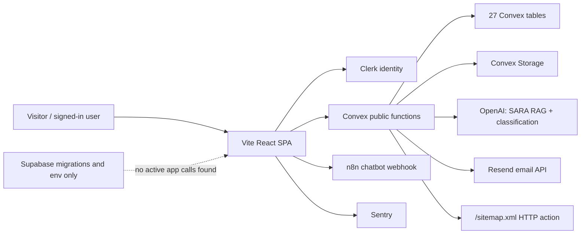

# Current System Architecture

## Runtime layers

- **Presentation:** React 18, React Router, Tailwind/shadcn/Radix, Framer Motion, Recharts.
- **Identity:** Clerk React and Convex JWT integration. Client-side role synchronization is unsafe.
- **Application/data:** Convex queries, mutations, actions, storage and one HTTP sitemap route.
- **AI path A:** authenticated `/sara`/`/sara-ai` → Convex action → OpenAI embeddings/chat → Convex history.
- **AI path B:** floating/full-page chatbot → unauthenticated browser request → n8n production/test webhook. It has separate history and governance.
- **Operations:** Vercel static SPA, Sentry, Resend. No worker queue beyond Convex scheduling; no push notification service.

## Boundary failures

The browser currently decides too much: role selection reaches `users.syncUser`, route guards can fail open, admin PIN logic is public, file metadata is trusted, and n8n is called directly. Convex exports are the true security boundary but checks are inconsistent and duplicated. The public website tables and legal-service records also have no formal separation because legal-service records do not yet exist.

## Current capabilities

Working from source/build: public content routes, content schema, static marketing, production bundle, Clerk/Convex provider wiring, public forms, Convex storage plumbing, SARA RAG code, analytics code. Unverified in live runtime: Clerk sign-up/login, role dashboards, CMS writes, emails, uploads, SARA answers, Convex logs, deployed data and all production access controls.
