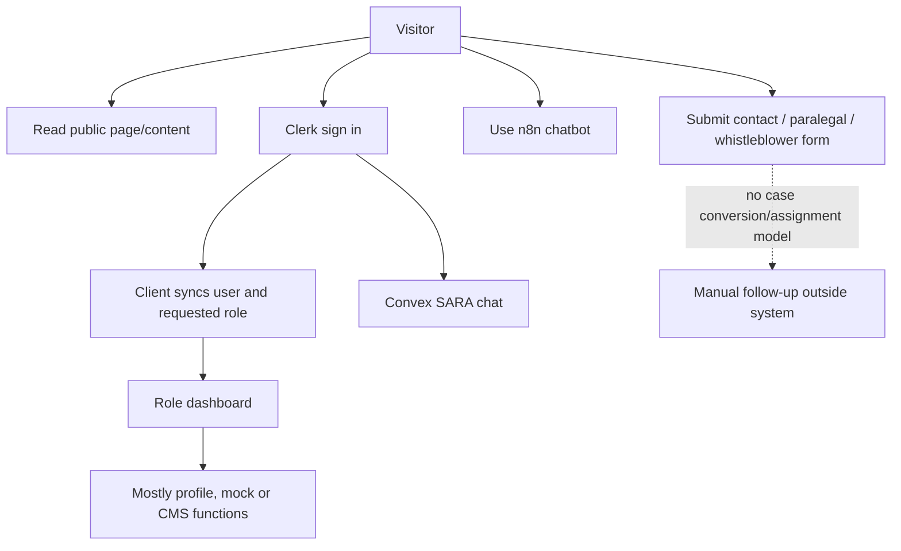

# Current User Journeys

## Current state

## Journey audit (required 24)

| # | Journey | Current state | Future functions/tables, controls and failure handling |
|---:|---|---|---|
| 1 | Read legal resource | publications/resources/FAQ; no unified taxonomy/offline | `content.list/get`, content/source/translation; public, cache + stale marker |
| 2 | Guest asks AI | n8n only; Convex path signs in | `ai.start/send`; guest consent/rate gate; emergency deterministic; escalate/error fallback |
| 3 | Guest intake then account | absent | local encrypted draft → `draft.claim`; users/consents/helpRequests; duplicate/expired-token handling |
| 4 | Submit help request | `/legal-help` is contact, not structured intake | `helpRequests.submit`; consent, safeguarding, attachment scan, receipt notification/audit |
| 5 | LSF triage | absent | `triageQueue.list`, `helpRequests.triage`; scoped staff, SLA/escalation |
| 6 | Convert request to case | absent | atomic `cases.createFromRequest`; idempotent; audit and beneficiary status |
| 7 | Assign paralegal | absent | `assignments.offer`; verified/capacity/service-area checks; private notification |
| 8 | Accept/decline | absent | `assignments.respond`; assignee only; reason and expiry/requeue |
| 9 | Communicate | AI chat only, not case-linked | `caseMessages.send/list`; case access, delivery/failure records, abuse reporting |
| 10 | Appointment | absent | `appointments.create/respond`; participants; reminders/timezone/conflicts |
| 11 | Request/upload document | generic public-ish storage | `attachments.request/create/finalize`; purpose ticket, scan/quarantine/access audit |
| 12 | Create referral | absent | `referrals.create`; explicit referral consent, target capability/capacity |
| 13 | Partner accepts/declines | absent | `referrals.respond`; target org member; expiry/reassignment |
| 14 | Record outcome | absent | `outcomes.record/approve`; assignee + supervisor rules, taxonomy version |
| 15 | Feedback | AI feedback only | `caseFeedback.submit`; beneficiary, anonymous option, complaint split |
| 16 | Reassignment request | absent | `reassignments.create/decide`; participant and supervisor; safety routing |
| 17 | Safeguarding escalation | keyword AI response only | `safeguarding.raise/resolve`; restricted team, silent safe UI, immutable audit |
| 18 | Publish knowledge | CMS exists; inconsistent RBAC | draft/review/publish workflow; editor/reviewer; website/mobile invalidation |
| 19 | Content on web/mobile | web Convex queries only | versioned content API, locale and offline bundle |
| 20 | Donor report | generic analytics, no cases | aggregate snapshots; de-identification threshold; approved donor scope/export audit |
| 21 | Explain document | absent | `documentReview.create`; consent, scan, AI policy, delete controls, professional-review escalation |
| 22 | Build letter | absent | template + guided facts + editable draft; explicit non-legal-document label |
| 23 | Evidence timeline | absent | evidence items/events/attachments; user controls, no admissibility claim |
| 24 | Paralegal offline sync | absent | encrypted local operation queue; version/conflict rules, attachment resume and visible status |

Every future state emits audit events for sensitive view/write/export, notification delivery records where applicable, and user-safe error states that do not disclose case type.
