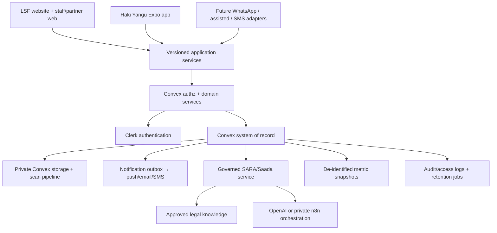

# Proposed Platform Architecture

## Principles

1. One Clerk identity plane and one Convex application source of truth.
2. Public CMS data, private service data and especially restricted safeguarding/whistleblower data have separate projections and authorization policies.
3. Web/mobile call stable service functions, not raw table CRUD.
4. Every external side effect uses an authenticated server adapter and outbox/delivery record.
5. Attachments default private and quarantined; access is record-scoped.
6. Analytics is allow-listed, minimized and separated from operational/legal records.
7. AI is a governed capability, never the owner of emergency contacts, roles or case state.

## Service boundaries

`identity`, `organisations`, `taxonomy`, `intake`, `cases`, `assignments`, `referrals`, `communications`, `appointments`, `attachments`, `knowledge`, `ai`, `notifications`, `safeguarding`, `feedback`, `reporting`, `audit`. Internal table migrations may evolve without changing the versioned client contracts.

## Repository strategy

Keep this website repository and create a separate `haki-yangu-mobile` repository only after contracts are approved. Share the Convex deployment and Clerk instance. Publish a small versioned private TypeScript contracts package when shapes stabilize. Do not monorepo-migrate a functioning public website during foundation repair.
