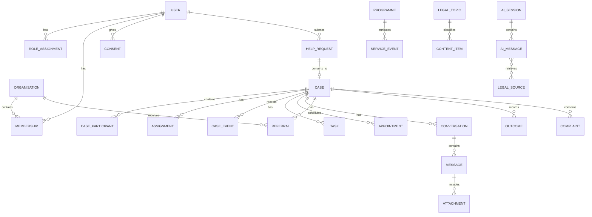
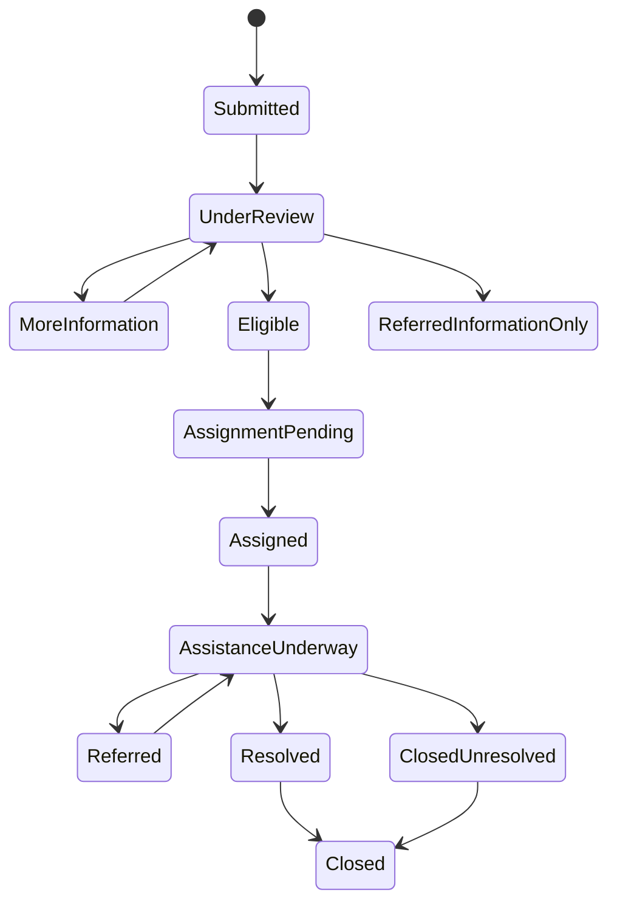
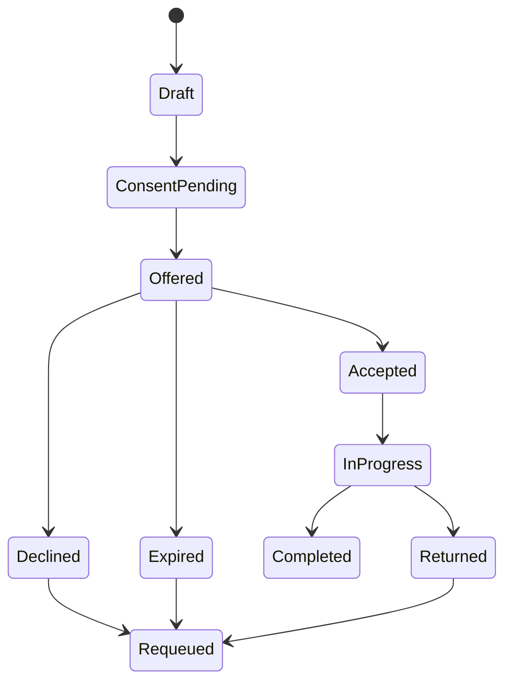

# Proposed Domain Model

## Entity plan

| Domain / entities | Existing coverage | Migration/index/access/offline decision |
|---|---|---|
| users, profiles, role assignments, devices, consents, verification | only `users` single role | migrate role to assignments; index Clerk subject/device/user; profiles/consents sensitive; devices needed for push |
| organisations, memberships | none | org type/status; membership `(org,user,status)`; all partner access membership-scoped |
| providers, paralegals, capabilities, service areas, languages, capacity | `paralegal_applications` only | approved application creates verification/provider profile; index region/category/availability; public projection separate |
| help requests, intake answers | contact form is not equivalent | immutable submitted snapshot plus draft; index owner/status/region/urgency; offline draft relevant |
| cases, participants, assignments, events, notes, tasks, outcomes, closures, safeguarding flags | none | case reference + version; strict participant/assignee/supervisor scope; notes and flags highly restricted |
| conversations, messages, attachments | only AI chats | case-linked participant set; cursor index; encrypted offline cache; attachments private/quarantined |
| referrals, status history, appointments, escalations, complaints, reassignments | none | explicit referral consent; target org; state histories; deadline indexes; offline actions selectively queued |
| legal topics, articles, FAQs, translations, audio, templates, source/review records | multiple CMS tables but no governance | extend/migrate; locale/status/version/topic indexes; public offline bundles |
| AI sessions/messages/sources/responses/safety/escalation/feedback/cost/prompt versions | five SARA tables | migrate chats; separate general/case purpose; monthly aggregate indexes; sensitive retention |
| programmes/projects/funding/service events/metric definitions/snapshots/attribution/periods | `programs` and generic analytics | extend without attributing outcomes twice; immutable metric definitions/snapshots |
| audit/access logs, retention policies, configuration, taxonomy versions | partial audit/settings | append-only, actor/record/action/time indexes; access logs restricted; no offline copy |

## Case lifecycle

Beneficiary labels are Submitted, Under review, Waiting for information, Assigned, Appointment scheduled, Referred, Assistance underway, Resolved, Closed. Internal sub-statuses never leak sensitive classification.

## Referral lifecycle

