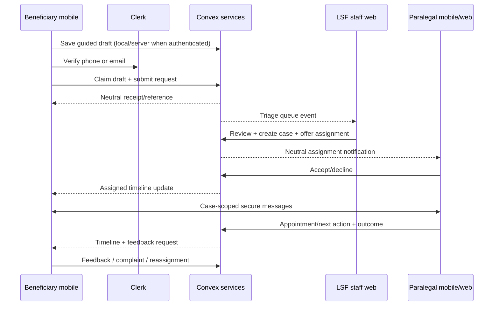

# First Vertical Slice Specification

## Outcome

A Tanzanian beneficiary can ask for help and follow an accountable human-supported result; LSF can triage and supervise it; a verified paralegal can accept and assist. No parallel backend or mobile-only state.

## Intake

Swahili-first steps: what happened in ordinary language; safe contact method; region/district; people involved at minimum necessary detail; urgency/safeguarding; desired help; evidence optional; accessibility; consent and referral consent separately. Save progress. Do not force civil/criminal categories.

## State and permissions

- Request owner sees own submission. Triage staff see submitted records within assignment scope.
- Case creation is atomic/idempotent and links source request; request cannot become two cases unintentionally.
- Assignment offer requires active verified paralegal, matching service area/capability and capacity. Only target assignee responds.
- Messages and attachments require active case participation; staff access follows supervision scope.
- Outcome requires taxonomy/evidence level and optional supervisor approval. Beneficiary may disagree without overwriting worker record.
- Complaint, reassignment and safeguarding paths do not notify the complained-about worker with sensitive details.

## Beneficiary timeline

Submitted → Under review → Waiting for information → Assigned → Appointment scheduled → Referred → Assistance underway → Resolved/Closed. Each event explains who acts next and expected timing without exposing internal risk labels.

## Failure states

Offline submission queues once; idempotency prevents duplicates. Invalid/stale assignment returns conflict and refreshes. Notification failure appears in delivery operations but does not roll back case state. Quarantined attachment is unavailable until scanned. Provider decline/expiry requeues. Service outage preserves draft and provides safe contact alternatives from governed configuration.

## Acceptance criteria

1. Full Swahili and English flow works on supported Android/iOS and staff web.
2. Cross-user, cross-case and cross-organisation access tests all deny.
3. A retry cannot duplicate request, case, message, appointment or outcome.
4. Sensitive push content is absent from lock screen.
5. Every sensitive view/write/export and state transition is auditable.
6. Assignment SLA, first response and outcome can be calculated from domain events.
7. Beneficiary can request reassignment/complain and can delete local private data.
8. Safeguarding escalation reaches the approved queue without AI inventing contacts.
9. Pilot operations have named owners, capacity limits, support and rollback.

## Explicitly out of slice

Evidence Vault beyond case attachments, letter builder, Before You Sign, broad Justice Navigator, donor portal, USSD/SMS, full partner workspace and autonomous AI case advice.
