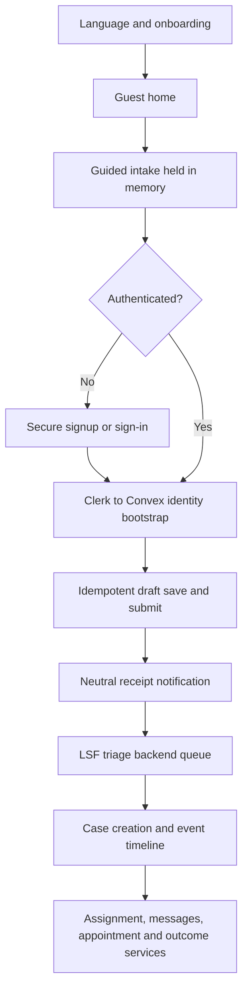

# Haki Yangu Mobile UI/UX Direction and Implementation

## Reference direction

The three approved boards are:

- `Haki Yangu Mobile Justice App Showcase.png`
- `Haki Yangu Mobile Justice UI Showcase.png`
- `Haki Yangu Legal Services App Storyboard.png`

They are visual direction, not literal screen contracts. Generated text artifacts, duplicate numbering, inconsistent navigation and unsupported operational states must not be copied into production.

## Product language

The experience is public-service trust with modern consumer mobile usability:

- warm, human and calm;
- plain-language questions instead of legal classification;
- action-oriented rather than document-oriented;
- Kiswahili first and complete English support;
- no fintech styling, flashy AI treatment or excessive gradients;
- strong contrast, large controls and readable type on older Android devices.

## Design tokens

| Token | Value | Use |
|---|---|---|
| LSF burgundy | `#8A1538` | primary action, navigation and identity |
| deep burgundy | `#66102B` | pressed/strong emphasis |
| orange | `#F16C22` | brand accent, not routine destructive action |
| peach | `#FFD9C7` | warm feature surface |
| soft pink | `#F3E6EF` | secondary surface and selected state |
| teal | `#238C8C` | support/service distinction |
| charcoal | `#222222` | primary text |
| background | `#FBF9FA` | warm application canvas |

Ubuntu is the initial product type family because it is readable, supports the brand direction and already exists in the LSF web ecosystem. The mobile build loads only regular, medium and bold weights.

## Stable navigation

```text
Home | My Cases | Get Help | Learn | Profile
```

`Get Help` is the emphasized central action. It begins a progressive request, not an unstructured contact form.

## Implemented flow



Sensitive intake text is not persisted in ordinary AsyncStorage. Language and onboarding preferences are non-sensitive and may be persisted there. Offline legal-intake persistence remains blocked until an approved encrypted storage and deletion policy is implemented.

## Backend contracts added

- normalized role assignments and additive legacy-role migration support;
- consent records;
- legal-help requests and structured intake answers;
- cases, participants, assignments and append-only case events;
- case conversations and idempotent messages;
- appointments, outcomes and beneficiary feedback;
- privacy-safe in-app notifications;
- server-side case access and worker authorization;
- state-transition validation, audit writes and retry indexes.

The schema is additive and deployed only to the connected Convex development deployment.

## Environment boundary

The current website environment contains a production-bound Clerk publishable key. Mobile local development must use a separate Clerk development instance and `pk_test_` key. The mobile config refuses to silently inherit the production key. This protects production identities and enables valid localhost/native development.

## Verified

- backend TypeScript;
- mobile TypeScript;
- Convex security function classification;
- case lifecycle transition tests;
- retry/index contract tests;
- privacy-safe notification contract test;
- website production build;
- Expo web export;
- onboarding, language switch, home navigation and progressive intake at a `390 × 844` viewport;
- direct Clerk advisory removed by upgrading to `@clerk/clerk-expo` `2.20.0`.

## Next vertical work

1. Add the LSF staff triage queue and request-to-case workflow to the existing web admin.
2. Add paralegal assignment inbox/respond screens against the implemented assignment contracts.
3. Add development Clerk instance values and run authenticated mobile-to-web end-to-end tests.
4. Add private attachment intents, validation, quarantine and access-controlled retrieval.
5. Add device registration, notification outbox delivery and neutral push templates.
6. Add appointments, outcomes, feedback, complaint and reassignment interfaces.
7. Establish governed knowledge publishing before connecting the mobile Learn and SARA surfaces to legal content.

