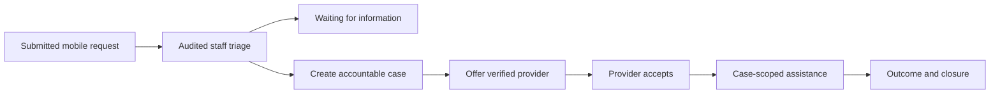

# Staff Triage and Case Operations

## Implemented scope

The existing `/dashboard/staff` route is now the Haki Yangu operations workspace. It uses the same Clerk identity, Convex deployment, request records and case records as the mobile client.

- `admin`, `supervisor` and `staff` may enter the workspace through effective active roles.
- Staff may filter the open legal-help queue and inspect request urgency and location.
- Opening a request is a mutation, not an unaudited read. It records `help_request.viewed_for_triage` and atomically moves a new submission to `under_review`.
- Review-state changes use an expected version so concurrent staff updates fail rather than overwrite.
- Case conversion is idempotent through the unique source-request index.
- Normal staff see only cases in which they are an active participant. Administrators and supervisors have oversight scope.
- Assignment offers may target only active `paralegal` or `provider_staff` accounts and do not grant case access until accepted.
- Case status updates use the server-owned lifecycle and optimistic version checks.

## Operational flow

## Deliberate boundaries

This phase does not claim provider matching quality, geographic/capacity ranking, staff messaging controls, attachments, safeguarding escalation queues or SLA alerts. The UI does not simulate those features. They require their own governed data and workflow controls.

## Verification

- Convex development functions deployed successfully.
- Root TypeScript check passes.
- Production web build passes.
- Haki Yangu contract tests pass.
- Security harness classifies all 188 public Convex functions.
